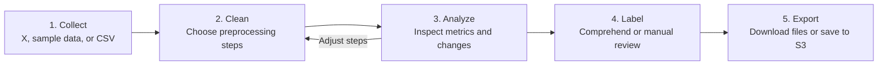
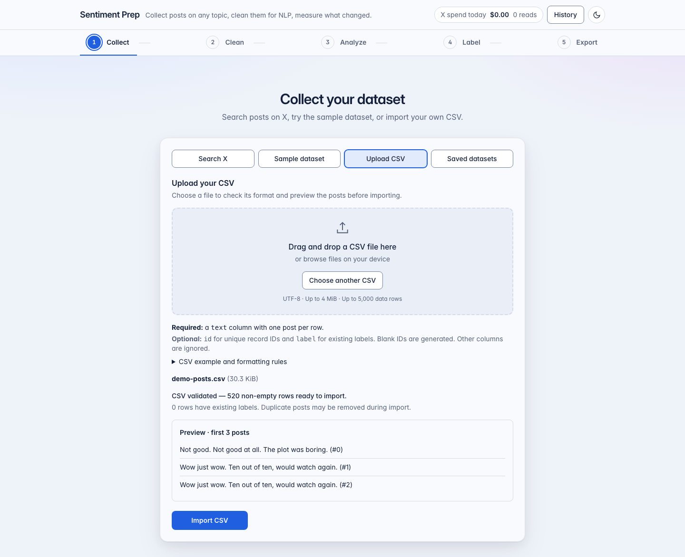
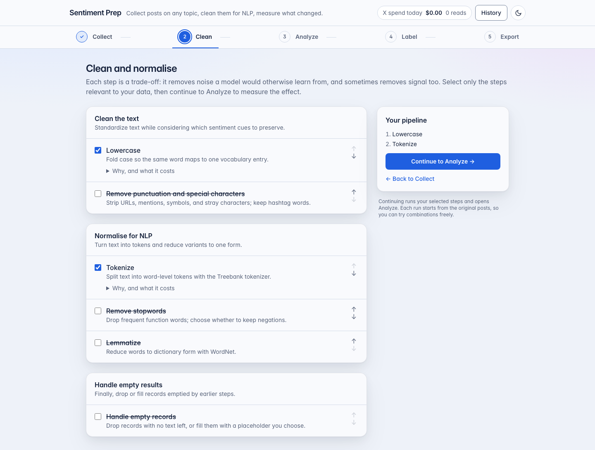
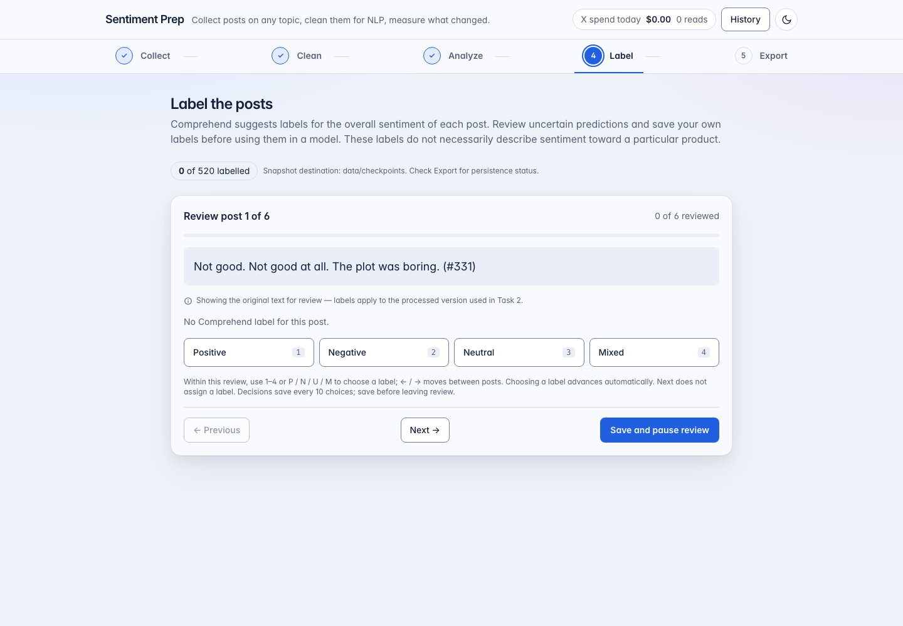
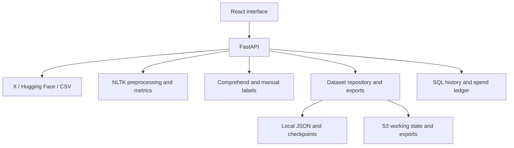

# Sentiment Prep

**Author: Ron Harper**

Collect text, choose how to preprocess it, inspect the changes, and review sentiment labels
before exporting a dataset. Sentiment Prep keeps the original text alongside the processed
version so you can see what each decision changed.


*Screenshots use synthetic demo posts and test sentiment responses.*

## The workflow



| Stage | What you can do |
| --- | --- |
| Collect | Search X within a date range, load the Hugging Face sample, or validate and import a CSV. Local development also provides a saved-dataset picker. |
| Clean | Select lowercasing, punctuation removal, tokenization, stopword removal, lemmatization, or empty-record handling. Every option starts unchecked. |
| Analyze | Compare vocabulary and token counts, inspect individual text changes, and optionally compare Comprehend predictions before and after preprocessing. |
| Label | Use Comprehend, label posts manually, or review machine predictions. Prioritize low-confidence results, choose a random sample, or review every post. |
| Export | Download Parquet, CSV, Excel, or a Markdown report. Choose a filename or save a new snapshot to S3. |

Prediction agreement measures consistency, not accuracy. Comprehend predicts overall post
sentiment; it does not necessarily describe sentiment toward the topic you searched for.

General X collection stops at the requested retained-post count, a spend cap, or provider
exhaustion. The **Consumer reactions** preset divides candidate quotas across the requested
days and records eligibility and sentiment together in one manual review. Its target counts only included,
fully reviewed records. If review leaves a shortfall, explicitly request another candidate
batch, review it, and repeat while results and budget remain available. These are bounded
samples; date coverage and representativeness must still be assessed.

Consumer reactions uses your own topic and dates and follows **Collect → Review & label → Clean →
Analyze → Export**. Choose whether to review each original and whether to label sentiment too.
A sentiment button keeps, saves, and advances; **Exclude post** does the same without an
explanation. **Review only** offers Keep and Exclude. Previous and Next revisit saved posts.
Skipping leaves posts unreviewed and runs no automated labeling. The fully reviewed export
still requires both a Keep decision and manual sentiment. General search, CSV and sample
datasets use the standard sentiment-labeling flow.

Collect shows total saved, added last request, and still to collect, with the first request's
saved count retained across later requests. Older datasets without batch history show unknown
counts. Tweet previews and review counters appear in Review; search and cost details expand on
demand. **Get more posts** keeps the same dataset and waits for X's retry deadline when rate
limited. It never runs automatically. Review
available candidates before purchasing another batch; the suggested quota accounts for posts
still awaiting review. Interrupted responses trigger a read-only refresh of saved progress.

## Screenshots

These screenshots show the current application using synthetic demonstration posts. Sentiment
responses in this capture are test fixtures, not live Comprehend results. Click an image to see
it at full size.

### Collect and validate a CSV

Drag and drop a file or use the file chooser. The server validates the complete file before
import and shows a preview of the first posts.



### Choose the preprocessing steps

Each technique includes its purpose and trade-offs. You can change the selection and rerun from
the original text.



### Review labels

Move between posts, correct earlier decisions, and save before pausing or finishing the review.
Keyboard shortcuts work within the review area.



### Export the results

Filenames are editable; extensions stay fixed. Stage checkpoints show whether the saved snapshot
is current.


## Run locally

Use Python 3.12 or newer, Node.js 22.12 or newer, npm, and Make on macOS or Linux. Windows users
can use WSL; local storage uses POSIX file locks.

```bash
git clone https://github.com/rharper12/NLP_Sentiment_Analyis.git
cd NLP_Sentiment_Analyis
python3 -m venv .venv
make setup
make dev
```

Open [localhost:5173](http://localhost:5173) for the application or
[localhost:8000/docs](http://localhost:8000/docs) for the API documentation.
`make setup` installs locked dependencies and NLTK resources and creates `backend/.env` if it is missing.
It preserves an existing configuration.

Start with **Upload CSV** to try the workflow without paid services. The example configuration
leaves Comprehend disabled and X credentials blank. **Sample dataset** loads labelled tweets
from Hugging Face and needs an internet connection.

Press Ctrl-C to stop `make dev`, or run `make stop` in another terminal to stop this checkout's
local servers, including Vite fallback ports. Run `make` to see all available commands.

### CSV format

```csv
text,id,label
"I love this phone!",post-1,positive
"Good camera, short battery life",post-2,mixed
```

- `text` is required. `id` and `label` are optional; other columns are ignored.
- Use UTF-8, comma-separated columns, and a header row. Quote text containing commas or line breaks.
- Supplied IDs must be unique. Blank IDs are generated.
- Files can contain up to 5,000 data rows and 4 MiB. Blank text rows are reported and skipped.
- Smaller datasets are accepted, with a reminder when fewer than 500 posts remain.

### Optional services

Edit [backend/.env.example](backend/.env.example)'s corresponding fields in your local
`backend/.env`. Never commit that file.

| Setting | Purpose |
| --- | --- |
| `X_BEARER_TOKEN` | Enable X search. See the [X query guide](https://docs.x.com/x-api/posts/search/integrate/build-a-query) for operators and examples. |
| `X_MAX_READS_PER_FETCH`, `X_MAX_READS_PER_DAY` | Limit billed reads, including posts later removed by filtering. |
| `AWS_PROFILE` | Use a named AWS profile, including an SSO profile. |
| `AWS_ACCESS_KEY_ID`, `AWS_SECRET_ACCESS_KEY`, `AWS_SESSION_TOKEN` | Alternative AWS credentials; an explicit key pair takes precedence over a profile. |
| `COMPREHEND_ENABLED` | Enable paid sentiment comparisons and labelling. Analyze comparisons can incur charges; Label shows a confirmation first. |
| `PRICING_ENABLED` | Look up Comprehend pricing for estimates. An unavailable estimate is shown as unavailable. |
| `DATA_BUCKET` | Enable S3 exports and S3 stage checkpoints. Local working JSON files still stay local. |
| `API_KEY` | Require an operator sign-in. Required for deployed access. |

`make aws-login` renews the SSO profile configured as `AWS_PROFILE` in `backend/.env` (or the
environment) and opens the AWS sign-in flow. Explicit static access keys take precedence, so the
command asks you to remove that key pair before switching the app to SSO. It does not collect,
score, or upload records. After signing in, run `make aws-check`, then resume the pending operation.
Local diagnostics identify SSO session failures separately from permission or network errors.

`make aws-check` verifies the configured AWS identity. `PROBE=1 make aws-check` also sends a small,
billable Comprehend request. Passing the offline tests does not verify your AWS access.

## Saved data and exports

In local development, working datasets are stored under
`backend/data/checkpoints/_work/<dataset-id>/` by default. A typical filename is
`iphone-duo-2026-09-23_13-40-17-UTC-0500.json`: topic, local creation date and time, and UTC offset.
`CHECKPOINT_DIR` changes the storage root.

Choose **Saved datasets** in Collect to open a new run from the original posts. Files are listed
by latest save, newest first. The original saved file stays intact; previous processing and
manual or Comprehend labels are cleared in the new run. Labels supplied by the original source
are retained. This picker is available only in local development.

Exports join original text, processed text, tokens, and the latest labels by record ID. Manual
labels take precedence, and the Comprehend prediction remains available alongside them.

| File | Contents |
| --- | --- |
| Parquet | Typed dataset columns; preferred for subsequent analysis or model training. |
| CSV | Dataset rows protected against spreadsheet formula execution. This protection can add a leading apostrophe; use Parquet when exact text matters. |
| Excel | A data sheet and an impact sheet with preprocessing statistics. |
| Markdown report | Source details, selected steps, measured changes, and labelling summary. |
| Original JSON | Original text and provenance without later annotations or processing state. Available from Collect. |

An S3 save writes a named Parquet file, `impact.json` containing preprocessing results, and
`manifest.json` containing dataset provenance and export metadata. Each save uses a new folder,
so repeating a filename preserves previous exports. Internal working state and stage checkpoints
have separate update rules; see [the storage architecture](docs/architecture.md#storage-and-process-lifecycle).

## Architecture

The frontend uses React, TypeScript, Vite, Tailwind CSS, and AG Grid Community. FastAPI serves the
API; NLTK handles preprocessing, and SQLAlchemy stores run history and the X spend ledger.



Local runs use a JSON journal and SQLite. AWS deployment uses a CloudFront site, API Gateway,
and a Lambda container. S3 holds deployed working state; paid X collection in Lambda requires
a shared PostgreSQL spend ledger. See the [architecture diagrams](docs/architecture-diagrams.md)
and [deployment guide](docs/deployment.md) for those paths.

## Development and verification

```bash
make check       # Ruff, mypy, TypeScript, ESLint, pytest, and Vitest
cd frontend
npm run build    # production build
```

Tests isolate the developer's environment and use temporary storage. X uses HTTP mocks,
Comprehend uses fakes, and S3 uses moto. The optional PostgreSQL concurrency test needs
`TEST_POSTGRES_URL` pointing to a disposable database.

Code review follows the [Broad Institute of MIT and Harvard coding and comment guide](https://mitcommlab.mit.edu/broad/commkit/coding-and-comment-style/):
clear names, focused responsibilities, consistent structure, and comments that explain decisions.
The repository uses Ruff's 100-column Python convention. See the
[developer guide](docs/developer-guide.md) and [latest review](docs/code-quality-review.md) for
conventions, findings, and verification results.

The [accessibility guide](docs/design-system.md) describes the keyboard checks and axe audit for
all five stages in light, dark, and mobile layouts.

## More documentation

- [How the app works](docs/how-the-app-works.md)
- [API reference](docs/api.md)
- [Preprocessing guide](docs/data-cleaning-guide.md)
- [NLP and sentiment primer](docs/nlp-sentiment-primer.md)
- [Logging and debugging](docs/logging-and-debugging.md)
- [Architecture decisions](docs/decisions.md)
- [All documentation](docs/README.md)
