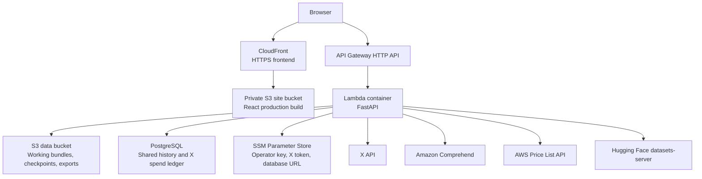
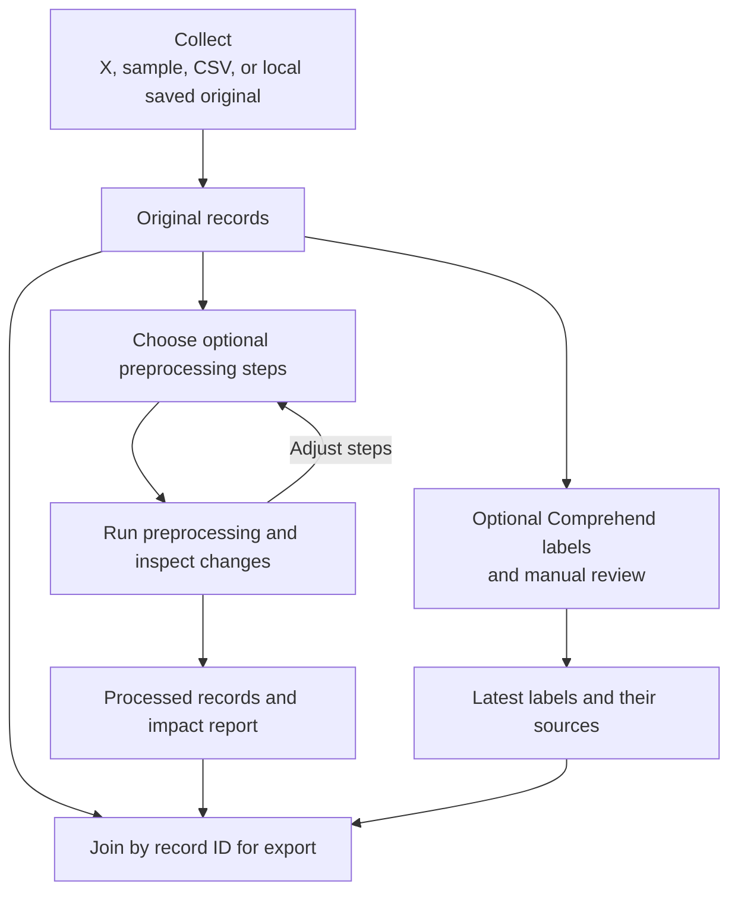
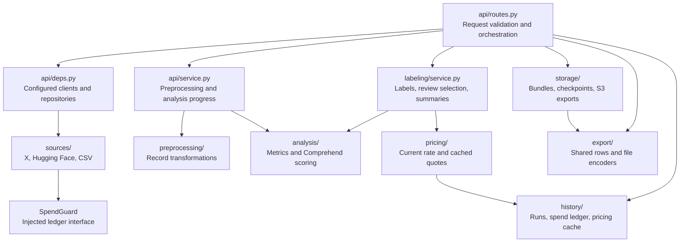
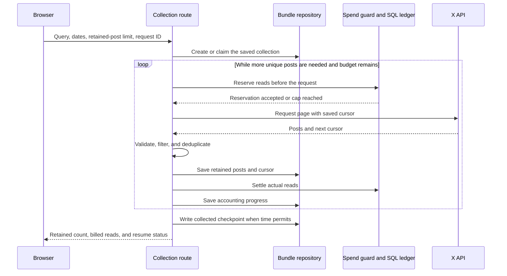
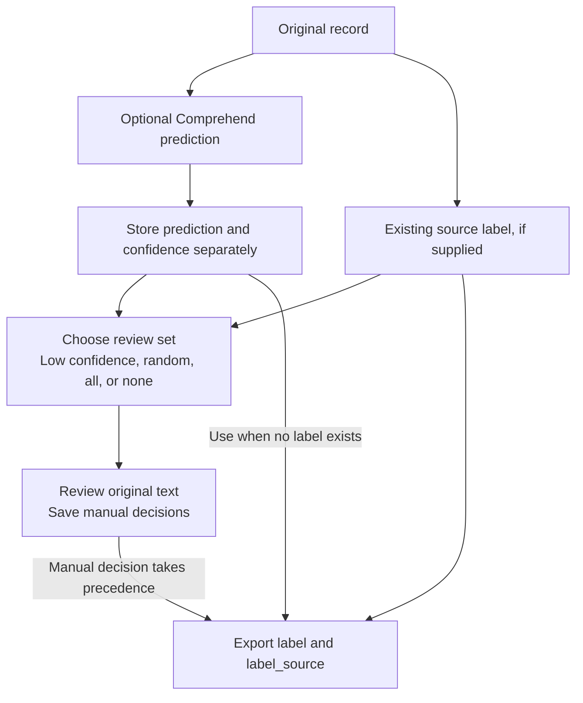
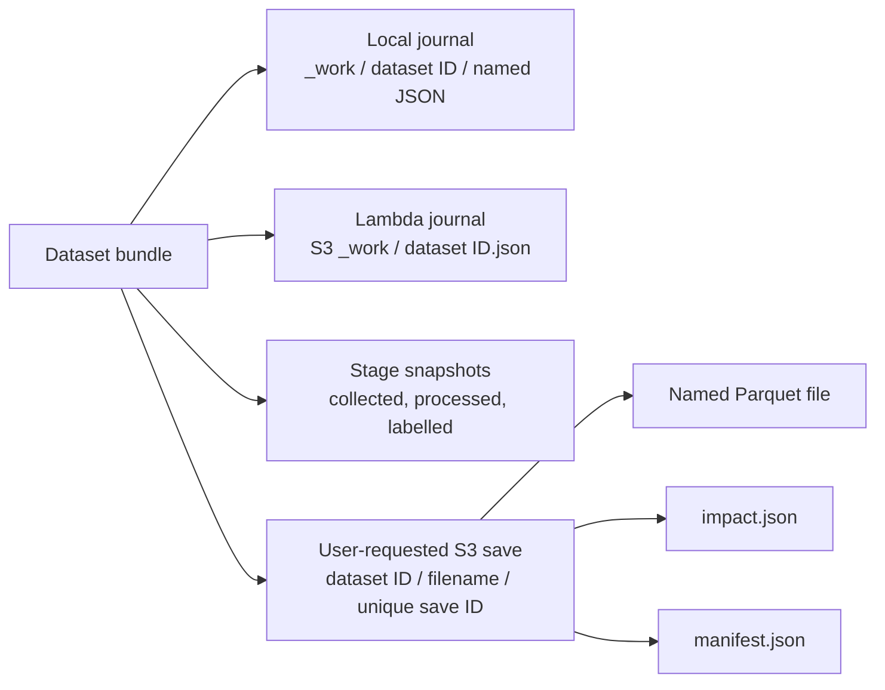

# Architecture diagrams

These diagrams describe the current implementation. GitHub renders the Mermaid blocks directly.
See [architecture.md](architecture.md) for storage and request-lifecycle details.

## 1. Deployment

Paid X collection in Lambda requires the shared PostgreSQL ledger. SQLite on Lambda's `/tmp`
is only an ephemeral fallback for history when paid X collection is not in use. Locally, Vite
proxies the API during development, working bundles use local JSON files, and history defaults
to SQLite.

## 2. Dataset workflow

The UI presents Collect, Clean, Analyze, Label, and Export in sequence. This diagram shows the
data dependencies: labelling reads original text, while Analyze can compare predictions for both
representations. Reprocessing starts from original text rather than repeatedly cleaning an
already processed version.

## 3. Module responsibilities

The spend guard accepts a ledger interface; dependency construction supplies `DbLedger`.
Sources do not import the concrete history implementation. Shared Pydantic models define records,
bundles, progress, and report shapes without starting clients or reading stored datasets.

## 4. X collection and pagination

The implementation requests at most 100 posts per page. Filtering happens inside the loop, so
removed posts do not satisfy the retained-post target. A partial response can be resumed with
the same request ID. Collection is not stratified by date.

The sequence shows successful pages. Caps, deadlines, cancellation, invalid responses, and rate
limits can stop a slice. An ambiguous transport failure may already have incurred a charge;
its reservation is retained conservatively. A failed required save prevents another paid page.

## 5. Labels and review

Manual decisions preserve the machine prediction for comparison. Pausing or finishing review
waits for pending saves. Reviewer agreement is measured on records with both a manual decision
and a Comprehend result; it is not a model-accuracy score. Low-confidence review intentionally
selects difficult cases and should not be treated as a representative evaluation sample.

## 6. Working files, checkpoints, and exports

Only the repository for the configured runtime owns working state. Local edits use filesystem
locks and atomic replacement; S3 edits use conditional writes and an exclusive claim. Stage
snapshots can be replaced as work progresses. User-requested S3 exports use a fresh UUID folder
for each save, including when the filename repeats.
