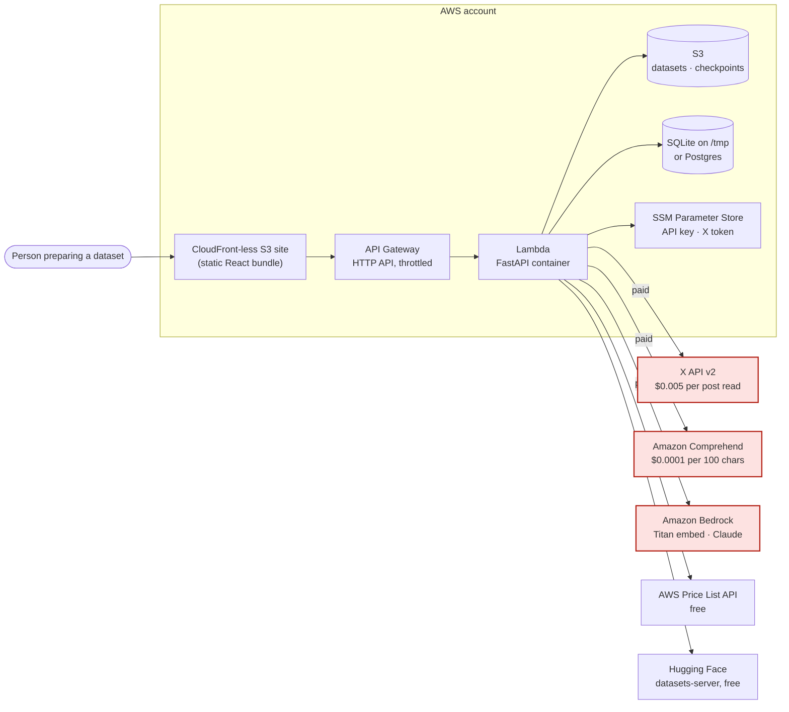
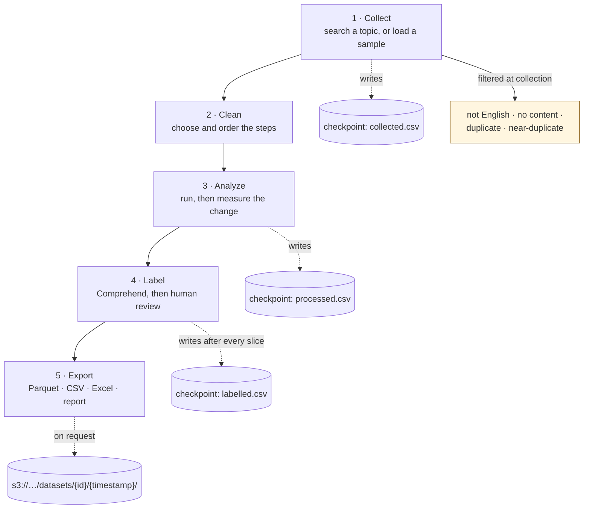
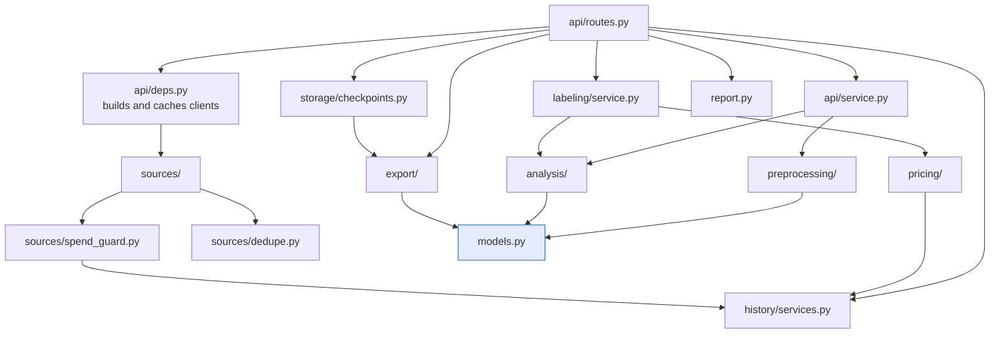
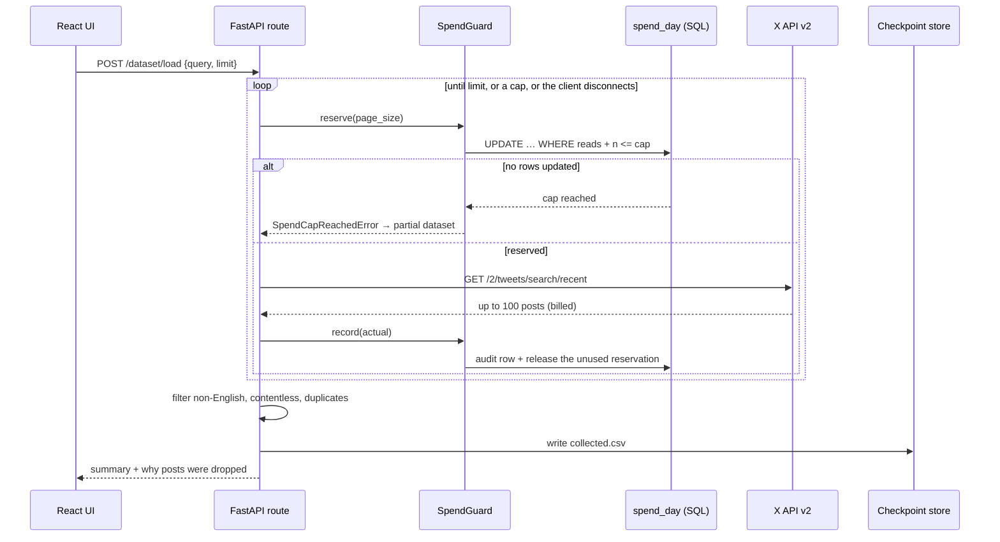
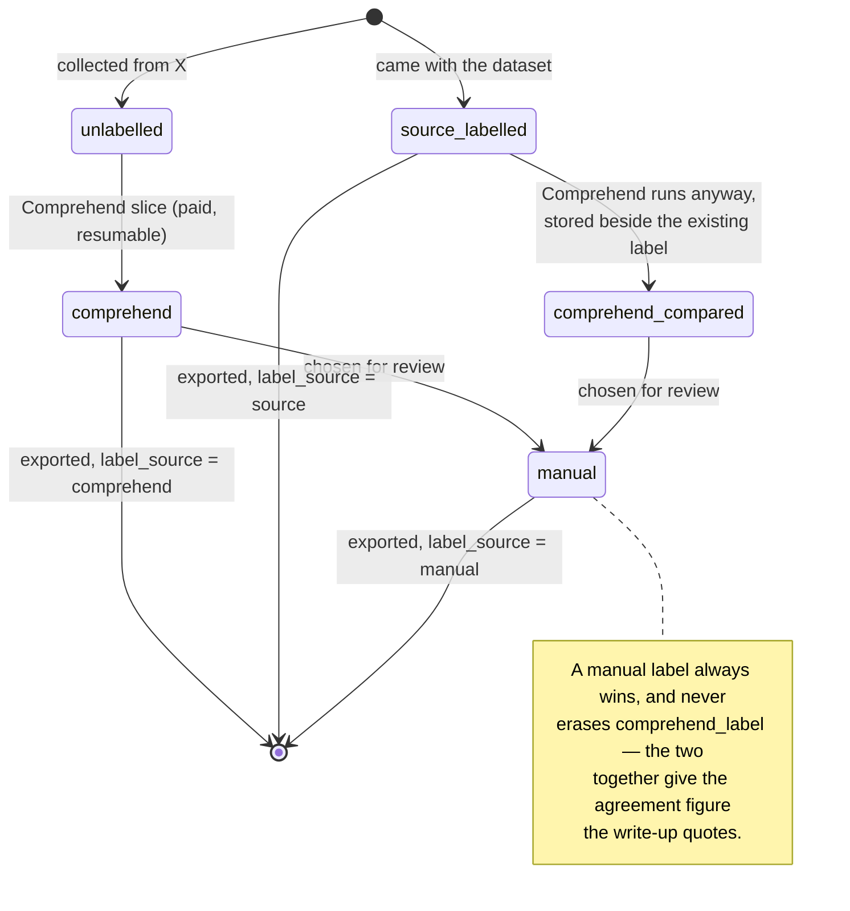

# Architecture diagrams

Five views, from the outside in. Every diagram renders on GitHub without a plugin.
Prose and the layer dependency rules live in [architecture.md](architecture.md); this file is the
visual companion.

## 1. System context

Who talks to what, and which parts cost money.

Red edges cost money. Everything red is capped, estimated before it runs, and checkpointed after.

## 2. The five stages, and what each one persists

Dropping contentless and duplicate posts **at collection** is deliberate: it fixes the record
count, so two preprocessing configurations are compared over identical rows.

## 3. Module dependencies

Arrows point the way imports go. Nothing points back up.

`models.py` depends on nothing but Pydantic, which is what lets every other module be tested
without a network, a database or an AWS account.

## 4. One paid request, end to end

The X fetch, because it is the path where a mistake costs real money.

The reservation is claimed **before** the request goes out and released after, so two concurrent
fetches cannot both spend the last of the day's budget.

## 5. How a label is produced, and where it comes from

Task 2 trains on `label` and evaluates on the rows where `label_source = manual`, which is the
only subset a human has confirmed.
