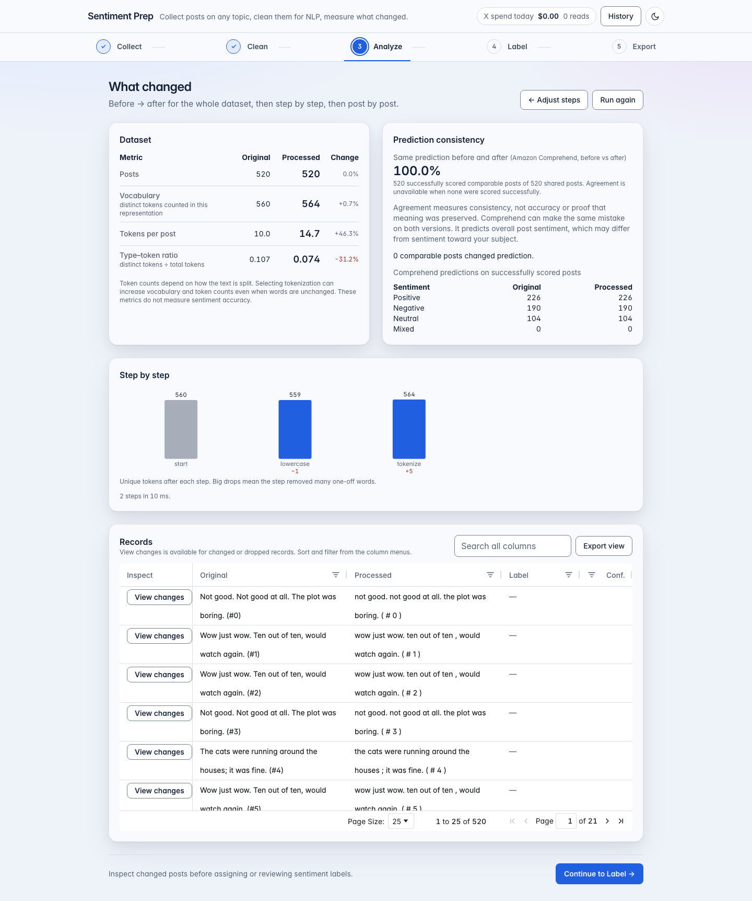
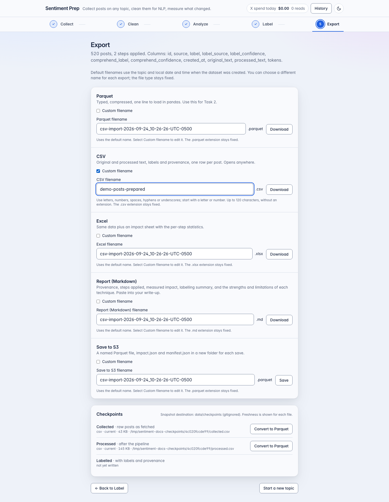

# How the app works

This follows one complete run from a click in the browser to the files that come out, naming the
module responsible at each step. Open the files as you read.

General search, CSV and sample datasets follow Collect → Clean → Analyze → Label → Export.
Consumer reactions follows Collect → Review & label → Clean → Analyze → Export (`frontend/src/App.tsx` owns the
stage state; each stage is a component under `components/stages/`).

## 1. Loading data

During local development, **Saved datasets → Open in Clean** selects a working JSON from
`CHECKPOINT_DIR/_work`. `/local-datasets` lists metadata only, paged newest first. The selected
file is validated by `storage/local_repository.py`, and `sources/saved_dataset.py` strips
later annotations. `/local-datasets/{id}/restore` saves a fresh copy without deduplicating again.
Both endpoints enforce the local runtime. The original file remains intact; restoration opens
Clean with all options unchecked for general datasets. Consumer collections instead reopen their
existing identity, decisions and pagination state; they enable Keep negations by default.
**Download original dataset** still creates an original-only JSON archive, not a review backup.

CSV selection uses `components/collect/CsvUpload.tsx`: drop a file or use the visible chooser.
`/dataset/upload/validate` runs the same parser as import, with no persistence. The component
shows errors, row counts, warnings, and a short preview before enabling Import CSV. Replacing
a file or leaving the tab cancels validation, so an old response cannot approve a different file.

In the **Collect** stage (`components/stages/CollectStep.tsx`) the person types a topic and presses
**Search and collect** (or loads the sample dataset, or uploads a CSV). The UI calls `POST /dataset/load` (or `/dataset/upload` for CSV) via
`frontend/src/api/client.ts`, passing an `AbortSignal` so the **Cancel** button can stop the request.

On the server, `api/routes.py::load_dataset` picks an adapter from `sources/`:

- `x_search.py` calls X's recent or full-archive search endpoint for the selected dates, page by page. Before each page it asks the
  `SpendGuard` (`sources/spend_guard.py`) whether the reads fit under the per-fetch and per-day
  caps; after each page it records returned reads and estimated spend in the SQLAlchemy ledger
  (`history/services.py::DbLedger`). It also polls `should_stop()`, which the route sets when
  the browser disconnects, so cancelling stops the spend at the next page.
- `huggingface.py` pages through the public datasets-server API. No credentials, no cost.
- `csv_upload.py` parses bytes from the multipart upload.

Each adapter returns a `Dataset` (`models.py`). The route stores it in a `DatasetBundle` through
the repository (`storage/repository.py`: a local journal locally, S3 in Lambda), writes a `DatasetRun`
row for the history tab, and returns a `DatasetSummary` with a 20-row preview and any warnings
(fewer than 500 records, truncated fetch).

### Consumer reactions and a small pilot

The collection selector explains both workflows before a search: **General search — sentiment
labeling** collects matching posts for cleaning and sentiment labeling, without manual eligibility
review or additional-candidate requests. **Consumer reactions — include/exclude + sentiment** adds
manual relevance review, sentiment review for included posts, and optional additional requests
toward a reviewed-record target. The choice affects a new collection, not an existing dataset.

**Collect → Search X → Collection option → Consumer reactions** creates a separate dataset.
The option preserves the topic, custom dates, and candidate quota you entered. It requires an
explicit query and completed calendar dates; it never inserts a product or announcement period.
If no timezone was selected, it starts with the browser's timezone. The final reviewed target
defaults to 500 and the per-author limit to two. Calendar dates are inclusive; the server converts
each local midnight using timezone rules. For example, explicitly choosing September 9–10, 2026,
in `America/Chicago` gives `[2026-09-09T05:00:00Z, 2026-09-11T05:00:00Z)`.
The timezone dropdown lists the browser's supported IANA zones plus UTC and preserves a valid
local alias. It controls the date boundaries, not the authors' locations. The server validates
the zone and converts the boundaries to UTC before sending the X request, accounting for daylight
saving changes within the selected dates.
Choose completed days; unfinished final days are rejected rather than silently shortened.

For the original iPhone research example, enter
`("iPhone Duo" OR #iPhoneDuo OR "foldable iPhone" OR "folding iPhone") lang:en -is:retweet`
yourself. Other products and topics use their own queries.
Dates remain separate provider parameters. Searches older than seven days require the configured
app's full-archive access; refusal stops with an actionable error and never falls back to recent
posts. The adapter follows X's [full-archive guide](https://docs.x.com/x-api/posts/search/quickstart/full-archive-search),
[query operators](https://docs.x.com/x-api/posts/search/integrate/build-a-query), and
[pagination guide](https://docs.x.com/x-api/posts/search/integrate/paginate), checked September 30,
2026. The guide uses `tweet.fields`; the newer API reference uses `post.fields`. The existing
adapter keeps the guide's request spelling and accepts both long-text/reference response spellings.
Actual account access and response compatibility require an authorized pilot; offline tests do
not prove them. The server credential remains `X_BEARER_TOKEN` in `backend/.env` (or its existing
SSM configuration), never a browser field.

The candidate target is split equally across local days, giving remainder slots to earlier days.
Each day has its own cursor and reverse-chronological order. There is no backfill from another
period when a day is empty. X's 10-result page minimum can retain up to nine extra candidates per
day; pages stay capped at 100 and all returned reads are accounted for. Daily counts show gaps.
This favors recent posts within each day and is a screened, bounded sample, not a representative
consumer survey. Keyword search misses replies without product names. No conversation crawling,
linked-page fetching, author histories or identity/bot scoring is added.

`eligibility.py` screens complete original text before cleaning. New collections use the
topic-neutral `consumer-reactions-v2` rules; reviewers confirm topic relevance against the saved
query. Existing `consumer-reactions-v1` collections retain their original product-specific rules
and saved decisions on resume. Multiple content signals suggest
news distribution, promotion or implementation discussions; conflicting or weak signals stay
pending. A link, a developer identity, or the word “giveaway” alone does not exclude a reaction.
Positive, negative, mixed, neutral and sarcastic consumer reactions use the same selection rules.
Language metadata, author and conversation IDs, references, URL metadata, and long text are kept
when supplied. Missing language goes to review; missing author IDs are independent and cannot
be author-capped. Missing timestamps or out-of-window results are not retained as candidates,
but their returned reads still count.

Duplicate screening reuses the existing exact/Jaccard matching logic. Identical complete text
after case/whitespace normalization gets a redundant-template exclusion suggestion and an
original-record reference. Any wording, punctuation or link differences remain reviewable;
negation differences cannot cause a near-duplicate removal. **No consumer candidate is deleted
by screening.** Every final inclusion/exclusion requires a human confirmation. The author cap
selects earliest timestamps, then string record IDs, among human inclusions. Sentiment and
popularity play no part. Excess candidates remain recoverable; correcting an inclusion releases
its author's slot. Additional candidates can change which records occupy those slots.

To run the pilot after authorizing its cost:

1. Start the existing app with `make dev`. Check the server's `X_BEARER_TOKEN`, archive entitlement,
   `X_MAX_READS_PER_FETCH`, `X_MAX_READS_PER_DAY`, and `X_COST_PER_READ_USD` settings. Do not paste
   secrets into the topic field. Select Consumer reactions, confirm the dates/timezone, and set
   **Posts to collect** to 50–100. Leave the final reviewed target at 500 to see the actual shortfall.
2. Inspect the displayed estimate and caps before **Search and collect**. That click authorizes
   collection. At a configured $0.005 per read, 50–100 reads estimate $0.25–$0.50, but filtering,
   page minimums and ambiguous retries can require more reads. X's [pricing documentation](https://docs.x.com/x-api/getting-started/pricing)
   describes daily resource-charge deduplication as a soft guarantee; the local ledger conservatively
   counts returned reads and is not an invoice. Review rejections are not cost-free.
3. Collect shows total saved, added last request, and still to collect. The first request's saved
   count remains visible after later requests; older datasets without this history show unknown
   counts. **Get more posts** finishes the same authorized goal. Search and cost details expand
   on demand; there are no tweet previews or review counters here. The search form collapses
   under **Start another collection**. Click **Continue to Review & label →** for step 2, before
   cleaning. Choose whether to review each post; skipping continues without approving any posts
   or starting automated labeling. If reviewing, choose whether to label sentiment too.
4. With sentiment enabled, choosing a sentiment keeps the post, saves both decisions in one
   request, and advances. **Keep without a label** defers sentiment; **Exclude post** needs no
   explanation. Review-only mode offers **Keep post** and **Exclude post**. **Previous** and
   **Next** navigate the original ordering without saving, including excluded posts. On reopening,
   review starts at the first unfinished choice for the selected mode. **Review settings** changes
   the mode without losing saved decisions. Screening never substitutes for human review.
5. Failed saves retain the attempted choice. Navigation and collection are locked until **Retry
   save** succeeds or **Discard unsaved choice** is selected. Buttons support Tab and Enter/Space;
   choosing sentiment only saves on activation, never on focus. Focus moves to the next heading
   after loading. **Continue to Clean →** configures preprocessing, Analyze shows its effect, and
   then Export offers **Reviewed consumer Parquet**. This export requires kept, manually labeled
   posts within the author limit. Skipped review and machine labels do not count as human review.
   Consumer analysis uses no cloud scoring. A separate explicit Comprehend request preserves
   manual labels, but can score those posts for comparison and includes them in its estimate.
6. If review leaves the target short, use **Get more posts** on the review screen.
   The quota subtracts pending reviews from the shortfall, within the 5,000-candidate limit. Finish
   existing pending reviews first to avoid unnecessary spending. Collection is always explicit;
   the review screen stays open while loading, and review resumes at an unfinished post. Saved
   decisions remain in place. Rejected collection requests display a recoverable error there.
   In review-only mode the quota uses kept posts within the author limit, without requiring
   optional sentiment labels; this does not change the strict export counts. Repeat manually
   while below the chosen target. An unfinished batch uses the same authorized
   target instead of increasing its quota. At the reviewed
   target, the button is replaced by a completion message and the API refuses further collection.
   A later review correction can reopen the option. This keeps dates, query,
   policy, seen IDs, per-day cursors and cumulative spend accounting. It never collects on an
   exclusion. Spend caps may prevent completion; request-budget pauses have no fake retry timer,
   whereas provider throttling does. Terminal request errors require correction and a new context.
   Source exhaustion and the candidate limit are shown explicitly; reaching the target is not
   guaranteed. Daily sampling and provider page minimums can change how many candidates return.

Policy version, date bounds, duplicate threshold, author cap, target and selection rule are
persisted with the collection. Changing material criteria requires a new collection. Working
bundles retain exclusions and decision history under existing local/S3 authorization and retention
rules; Lambda working state still expires after seven days. Original-only downloads and ordinary
CSV checkpoints are not substitutes for that working review state.

## 2. Choosing steps

`GET /steps` returns the six steps in recommended order with their rationale, read from
`resources/rationale.yaml`. The **Clean** stage (`CleanStep.tsx`) shows server-provided cleaning and normalization groups, followed by the final empty-record
sweep; display and movement eligibility use the same group metadata.
Each step expands to show what it helps and what it costs: the reducer in `hooks/usePipelineConfig.ts` tracks order, on/off state, and the
two per-step options (negation handling, missing-data strategy). All Clean-screen checkboxes start
unchecked, including the keep-negations option, except Consumer reactions enables Keep negations.
**Continue to
Analyze** runs the selected steps and opens the results; with none selected, it analyzes the
original text unchanged. A run may call the enabled analysis services.
Consumer runs skip automatic cloud sentiment scoring; analysis covers the candidates, not just
the final reviewed sample.

## 3. Running the pipeline

`POST /dataset/{id}/preprocess` receives the ordered step names. `api/service.py::run_preprocessing`:

1. Instantiates the steps from `preprocessing/STEP_REGISTRY` (`build_steps`).
2. Runs `preprocessing/pipeline.py::Pipeline`, which applies each step to every record. The base
   class (`preprocessing/base.py`) does the bookkeeping: vocabulary before/after, average tokens,
   duration, and five sample diffs, producing one `StepResult` per step.
3. Computes deterministic `DatasetMetrics` (`analysis/metrics.py`) for the original and processed
   datasets.
4. Optionally compares Comprehend predictions on both versions and reports agreement and
   distributions (`analysis/comprehend_scorer.py`). Successful results are cached and persisted;
   provider failures append to `report.warnings` instead of discarding deterministic output.

The route saves the updated bundle, records a `PipelineRun` row, and returns metrics plus the
`ImpactReport`. The **Analyze** stage (`AnalyzeStep.tsx`) renders the before/after table, the
prediction consistency panel, the vocabulary waterfall (`StepWaterfall.tsx`), and the records.
Agreement measures consistency, not accuracy or proof that meaning was preserved. Token counts
depend on the selected tokenization.

## 4. Reading the results

The records section of Analyze uses AG Grid Community (`RecordsGrid.tsx`), fetching all pages
once per run via `GET /dataset/{id}/records`, which joins original and processed
records by id (dropped records show as "dropped"). Sorting, filtering and pagination happen in the browser.
Only changed or dropped records offer **View changes**. Activating that button with Enter/Space,
or clicking a changed row, opens `DiffDialog.tsx`. It compares the exact text in order, highlighting
removals with strikethrough and additions with underlines, including case and punctuation changes.
Whitespace-only edits use visible markers for spaces, tabs and line breaks.

## 5. Labelling

Sentiment classification (Task 2) needs a label per post. The **Label** stage
(`components/stages/LabelStep.tsx`, backend `labeling/service.py`) offers two routes and lets you
combine them:

- **Comprehend.** `GET …/labels/estimate` prices the job from a live AWS Price List quote (100-character units,
  3-unit minimum; unavailable when no usable quote exists) and the UI shows it as a chip. A confirmation dialog repeats
  the figure; only then does the UI loop `POST …/labels/comprehend` in slices of 250. Each slice
  is saved server-side and the `labelled` checkpoint rewritten before the next starts, so committed results survive a crash
  or cancel; provider success immediately before persistence remains ambiguous, and re-running skips records that already have a
  Comprehend label. Records with a label from the source keep it; Comprehend's opinion is stored
  beside it as `comprehend_label`.
- **Manual review.** Choose lowest-confidence first (recommended after Comprehend), none, everything, or a
  random sample (count or percent, fixed seed). Priority review excludes previously reviewed
  posts and puts missing scores first, followed by ascending confidence.
  The reviewer shows one post at a time — always the **original** text, with a caption saying so,
  because a reviewer should judge what a human would actually read — alongside Comprehend's
  suggestion and confidence; keys 1–4 (or P/N/U/M) decide. The sample-size field accepts a post
  count or a percent and shows both readings ("100 posts (17% of 600)"), clamped to the dataset. Decisions flush every ten and on finish. A manual label sets
  `label_source="manual"` and never erases `comprehend_label`, which is how the summary computes
  reviewer-vs-Comprehend agreement. This describes reviewed posts only; prioritizing low scores
  is a targeted error check, not an estimate of overall accuracy. Previous/Next and arrow keys
  move without assigning a label. Review completion counts decisions, not posts visited.
  Save and pause/finish waits for all queued decisions; only then does the summary confirm saved
  labels. Return to selected review reopens the queue with saved choices. Corrections are used in
  CSV, Excel, Parquet, reports, and labelled checkpoints; original text and machine scores remain.

## 6. Checkpoints

`storage/checkpoints.py` writes a CSV snapshot the moment a stage's data exists: `collected` after
a fetch or upload, `processed` after each pipeline run, `labelled` after every labelling call.
Locally they land in `data/checkpoints/<dataset_id>/` (gitignored); with a bucket configured they go
to `s3://<bucket>/checkpoints/<dataset_id>/` via `upload_fileobj`, which boto3 turns into a multipart
upload above 8 MB. A checkpoint failure is logged and never fails the request that just spent
money. Public-safe warnings disclose write failures. The Export stage shows revision status;
old files are retained but marked stale/failed when appropriate. CSV rewrites invalidate older
Parquet revisions, and preprocessing reruns invalidate labelled snapshots.

## 7. Exporting

The **Export** stage (`ExportStep.tsx`) offers CSV, Excel, Parquet, and Markdown downloads plus the S3 save.

Consumer collections additionally offer **Reviewed consumer Parquet** with a distinct `-reviewed`
default filename. It contains only current author-selected human inclusions with a valid,
human-reviewed sentiment. Original text, machine labels/scores, human review state and eligibility
history remain in rows; policy, query, counts and complete/partial status are embedded in Parquet
metadata. Missing confidence is allowed and human confidence is never invented. The other formats
remain full candidate archives, including excluded/unreviewed rows. Downloads use existing
authorization and `Cache-Control: no-store`. Each reviewed download regenerates current decisions.
Changed source rows, eligibility or labels invalidate affected analysis and downstream checkpoints;
old snapshot files remain marked stale. Previously downloaded files must be downloaded again after
corrections. After finishing review, rerun Clean/Analyze if processed text or a fresh report is needed.

`export/rows.py` defines one flat row shape used by all three outputs so they never disagree:
`csv_export.py`, `excel_export.py` (adds an `impact` sheet), and `storage/s3_store.py`
(Parquet + `impact.json` + `manifest.json`). `report.py` renders the Task 1 Markdown from the
`ImpactReport` and the human-written rationale.

## 8. Cross-cutting: logging, spend, history

Every request gets a `request_id` bound into the logging context by the middleware in
`api/app.py`; every log line for that request carries it, and the header `X-Request-Id` returns it
to the browser, where error notices display it. See [Logging and debugging](logging-and-debugging.md).

The spend chip in the header reads `GET /spend`, which sums the ledger rows. The **History** dialog
(`HistoryDialog.tsx`) reads `GET /history`. Both are SQLAlchemy queries against `history/`.

### Review workflow design references

The single-pass consumer review groups related decisions around the same original post. The
visible step order follows the task, with summary details disclosed on demand and saved choices
available for correction. This applies [Nielsen Norman Group's usability heuristics](https://www.nngroup.com/articles/ten-usability-heuristics/)
on visible state, recognition, recovery and focused presentation. The step indicator and focus
behavior follow [W3C's multi-page form guidance](https://www.w3.org/WAI/tutorials/forms/multi-page/),
and save feedback uses [status messages](https://www.w3.org/WAI/WCAG22/Understanding/status-messages.html).
Sentiment choices are action buttons, with the save-and-advance behavior explained before use,
consistent with [W3C's guidance on context changes](https://www.w3.org/WAI/WCAG22/Understanding/on-input.html).
These references inform the design; automated checks do not replace assistive-technology and user testing.
