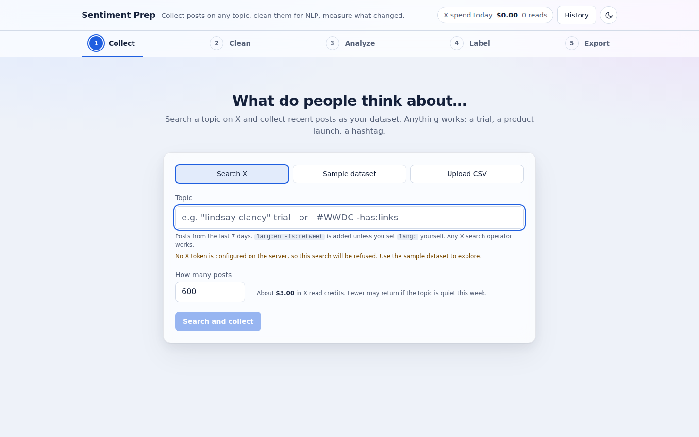
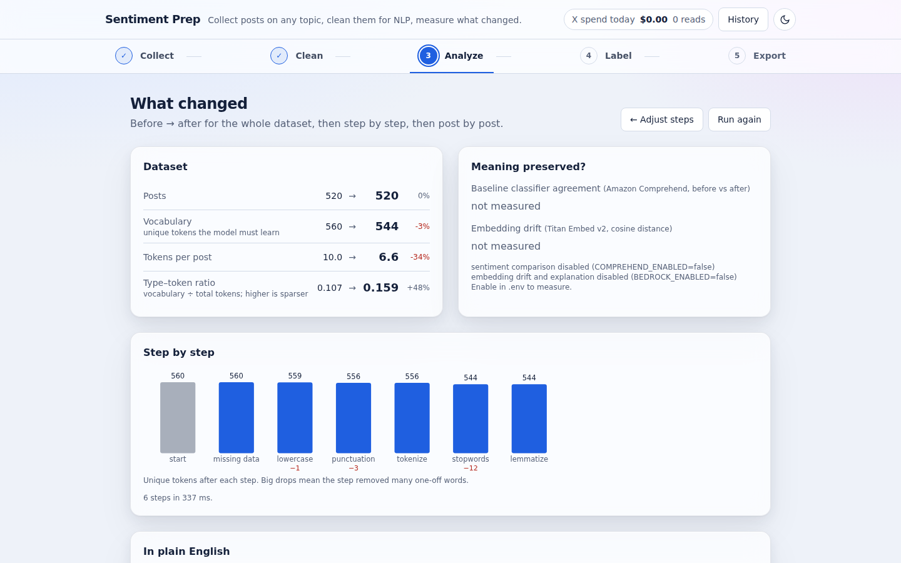
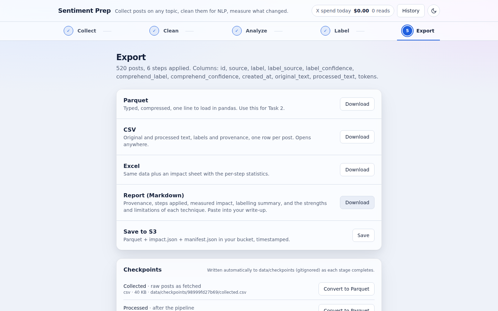
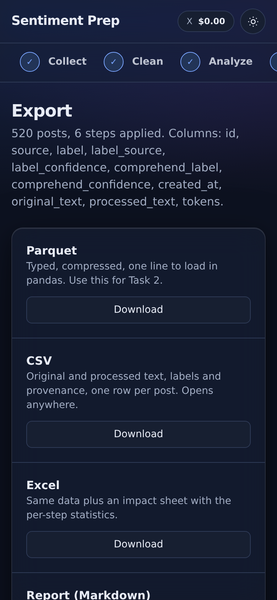

# How the app works

This follows one complete run from a click in the browser to the files that come out, naming the
module responsible at each step. Open the files as you read.

The UI is a five-stage flow: Collect → Clean → Analyze → Label → Export (`frontend/src/App.tsx` owns the
stage state; each stage is a component under `components/stages/`).

## 1. Loading data

In the **Collect** stage (`components/stages/CollectStep.tsx`) the person types a topic and presses
**Search and collect** (or loads the sample dataset, or uploads a CSV). The UI calls `POST /dataset/load` (or `/dataset/upload` for CSV) via
`frontend/src/api/client.ts`, passing an `AbortSignal` so the **Cancel** button can stop the request.

On the server, `api/routes.py::load_dataset` picks an adapter from `sources/`:

- `x_search.py` calls X's recent-search endpoint page by page. Before each page it asks the
  `SpendGuard` (`sources/spend_guard.py`) whether the reads fit under the per-fetch and per-day
  caps; after each page it records what was billed in the SQLAlchemy ledger
  (`history/services.py::DbLedger`). It also polls `should_stop()`, which the route sets when
  the browser disconnects, so cancelling stops the spend at the next page.
- `huggingface.py` pages through the public datasets-server API. No credentials, no cost.
- `csv_upload.py` parses bytes from the multipart upload.

Each adapter returns a `Dataset` (`models.py`). The route stores it in a `DatasetBundle` through
the repository (`storage/repository.py`: a local journal locally, S3 in Lambda), writes a `DatasetRun`
row for the history tab, and returns a `DatasetSummary` with a 20-row preview and any warnings
(fewer than 500 records, truncated fetch).

## 2. Choosing steps

`GET /steps` returns the six steps in recommended order with their rationale, read from
`resources/rationale.yaml`. The **Clean** stage (`CleanStep.tsx`) shows server-provided cleaning and normalization groups, followed by the final empty-record
sweep; display and movement eligibility use the same group metadata.
Each step expands to show what it helps and what it costs: the reducer in `hooks/usePipelineConfig.ts` tracks order, on/off state, and the
two per-step options (negation handling, missing-data strategy). All Clean-screen checkboxes start
unchecked, including the optional model explanation and keep-negations option. **Continue to
Analyze** runs the selected steps and opens the results; with none selected, it analyzes the
original text unchanged. A run may call the enabled analysis services.

## 3. Running the pipeline

`POST /dataset/{id}/preprocess` receives the ordered step names. `api/service.py::run_preprocessing`:

1. Instantiates the steps from `preprocessing/STEP_REGISTRY` (`build_steps`).
2. Runs `preprocessing/pipeline.py::Pipeline`, which applies each step to every record. The base
   class (`preprocessing/base.py`) does the bookkeeping: vocabulary before/after, average tokens,
   duration, and five sample diffs, producing one `StepResult` per step.
3. Computes deterministic `DatasetMetrics` (`analysis/metrics.py`) for the original and processed
   datasets.
4. Optionally enriches: Comprehend labels both versions and reports agreement
   (`analysis/comprehend_scorer.py`); Titan embeds a seeded sample and reports cosine drift
   (`analysis/embeddings.py`); Bedrock writes a prose explanation from the numbers only
   (`analysis/bedrock_explainer.py`, prompt in `resources/explain_prompt.txt`). Each is wrapped in
   a try/except that appends to `report.warnings` instead of failing the request.

The route saves the updated bundle, records a `PipelineRun` row, and returns metrics plus the
`ImpactReport`. The **Analyze** stage (`AnalyzeStep.tsx`) renders the before/after table, the
"meaning preserved" panel, the vocabulary waterfall (`StepWaterfall.tsx`), the explanation, and
the records.

## 4. Reading the results

The records section of Analyze uses AG Grid Community (`RecordsGrid.tsx`), fetching all records
once via `GET /dataset/{id}/records`, which joins original and processed
records by id (dropped records show as "dropped"). Sorting, filtering and pagination happen in the browser. Activating a native View changes button with Enter/Space, or clicking a row, opens `DiffDialog.tsx`, which
strikes through words that disappeared and underlines words that were introduced (lemmas,
split contractions).

## 5. Labelling

Sentiment classification (Task 2) needs a label per post. The **Label** stage
(`components/stages/LabelStep.tsx`, backend `labeling/service.py`) offers two routes and lets you
combine them:

- **Comprehend.** `GET …/labels/estimate` prices the job from a live AWS Price List quote (100-character units,
  3-unit minimum; unavailable when no usable quote exists) and the UI shows it as a chip. A confirmation dialog repeats
  the figure; only then does the UI loop `POST …/labels/comprehend` in slices of 250. Each slice
  is saved server-side and the `labelled` checkpoint rewritten before the next starts, so committed results survive a crash
  or cancel; provider success immediately before persistence remains ambiguous, and re-running skips records that already have a
  Comprehend label. Records with a label from the source keep it; Comprehend's opinion is stored
  beside it as `comprehend_label`.
- **Manual review.** Choose none, everything, or a random sample (count or percent, fixed seed).
  The reviewer shows one post at a time — always the **original** text, with a caption saying so,
  because a reviewer should judge what a human would actually read — alongside Comprehend's
  suggestion and confidence; keys 1–4 (or P/N/U/M) decide. The sample-size field accepts a post
  count or a percent and shows both readings ("100 posts (17% of 600)"), clamped to the dataset. Decisions flush every ten and on finish. A manual label sets
  `label_source="manual"` and never erases `comprehend_label`, which is how the summary computes
  reviewer-vs-Comprehend agreement, the number to quote in the write-up.

## 6. Checkpoints

`storage/checkpoints.py` writes a CSV snapshot the moment a stage's data exists: `collected` after
a fetch or upload, `processed` after each pipeline run, `labelled` after every labelling call.
Locally they land in `data/checkpoints/<dataset_id>/` (gitignored); with a bucket configured they go
to `s3://<bucket>/checkpoints/<dataset_id>/` via `upload_fileobj`, which boto3 turns into a multipart
upload above 8 MB. A checkpoint failure is logged and never fails the request that just spent
money. Public-safe warnings disclose write failures. The Export stage shows revision status;
old files are retained but marked stale/failed when appropriate. CSV rewrites invalidate older
Parquet revisions, and preprocessing reruns invalidate labelled snapshots.

## 7. Exporting

The **Export** stage (`ExportStep.tsx`) offers CSV, Excel, Parquet, and Markdown downloads plus the S3 save.

`export/rows.py` defines one flat row shape used by all three outputs so they never disagree:
`csv_export.py`, `excel_export.py` (adds an `impact` sheet), and `storage/s3_store.py`
(Parquet + `impact.json` + `manifest.json`). `report.py` renders the Task 1 Markdown from the
`ImpactReport` and the human-written rationale.

## 8. Cross-cutting: logging, spend, history

Every request gets a `request_id` bound into the logging context by the middleware in
`api/app.py`; every log line for that request carries it, and the header `X-Request-Id` returns it
to the browser, where error notices display it. See [Logging and debugging](logging-and-debugging.md).

The spend chip in the header reads `GET /spend`, which sums the ledger rows. The **History** dialog
(`HistoryDialog.tsx`) reads `GET /history`. Both are SQLAlchemy queries against `history/`.

